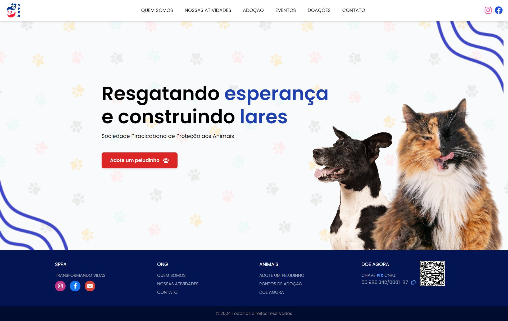

<h1>🚀 Sociedade Piracicabana de Proteção aos Animais</h1>
🔖  Sobre

Este Trabalho de Conclusão de Curso será dedicado à organização SPPA, com quem firmamos um acordo para auxiliar  a ONG na criação de um site com banco de dados e responsivo para os usuários.

##  ✨Tecnologias utilizadas

O projeto foi desenvolvido utilizando as seguintes tecnologias

- HTML
- CSS (Tailwind)
- PHP
- Javascript

📄 Licença

Feito com 💜 por Yves L. - Gabriel M. - Johnny A. - Jonas S. - Jonas A. 😊

 

